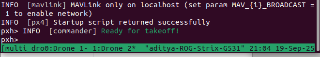
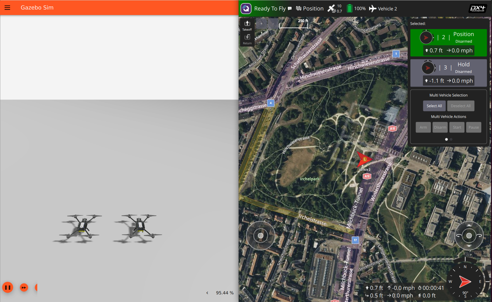

# TII_NEU_Project

Useful Repos

https://github.com/Apoorv-1009/PX4-Aerial-Swarm-Reconstruction/tree/main/src/px4_swarm_controller

https://www.youtube.com/watch?v=V5-uTaaK1aA

https://github.com/Apurv354/flight_pattern_px4

## Inside PX4 Docker

### To Spawn only one drone and run the simulation, run the following command : 

`PX4_SYS_AUTOSTART=4001 PX4_SIM_MODEL=gz_x500 ./build/px4_sitl_default/bin/px4`

### To Spawn Multiple Drones, place this file "multi_uav_sitl.sh" inside the PX4-Autopilot folder inside the PX4 Docker and run it as follows 

`bash multi_ual_sitl.sh`

You will see a tmux terminal opening with 2 drones spawned like this :

NOTE : Use Ctrl+B and N to toggle between the terminals of the drones
and Ctrl+C and `bash multi_ual_sitl.sh` to end the session

   

## Basic Setup to bring up the dockers 

### Enter ROS2 Docker using the following commands : 

`docker start px4_agent_ws`

`docker exec -it px4_agent_ws bash`

#### Run the following inside the ROS2 Docker :

`launch_all_nodes.sh`

Which essentially runs the following commands in a tmux terminal : 

`ros2 launch drone_basic_control launch_all_nodes.launch.py`

`ros2 run goal_manager goal_manager_server`

`ros2 launch system_bringup launch_nodes.launch.py `

NOTE : Use Ctrl+B and N to toggle between the terminals and Ctrl+C and `launch_all_nodes.sh` to end the session. 

### Launch the DDS Agent on a new terminal (outside the docker) : 

`MicroXRCEAgent udp4 -p 8888`

### Enter PX4 Docker using the following commands : 

`docker start px4-dev-test`

`docker exec -it px4-dev-test bash`

NOTE : Enter the PX4 directory before running commands 

`cd PX4-Autopilot`

### Square Pattern Example 

Outside the Docker, run the following commands in 2 separate terminals 

#### Terminal 1 

`cd drone_pattern`

`python3 square_pattern.py`

#### Terminal 2 

`cd mqtt_client`

`python3 mqtt_client.py`
